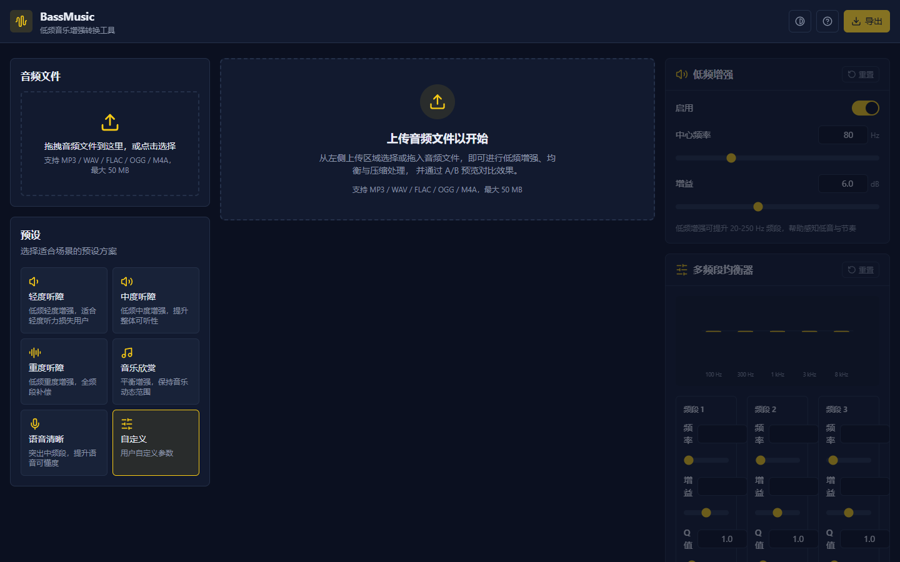
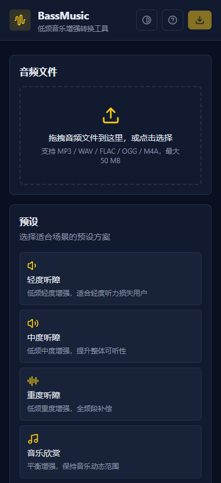
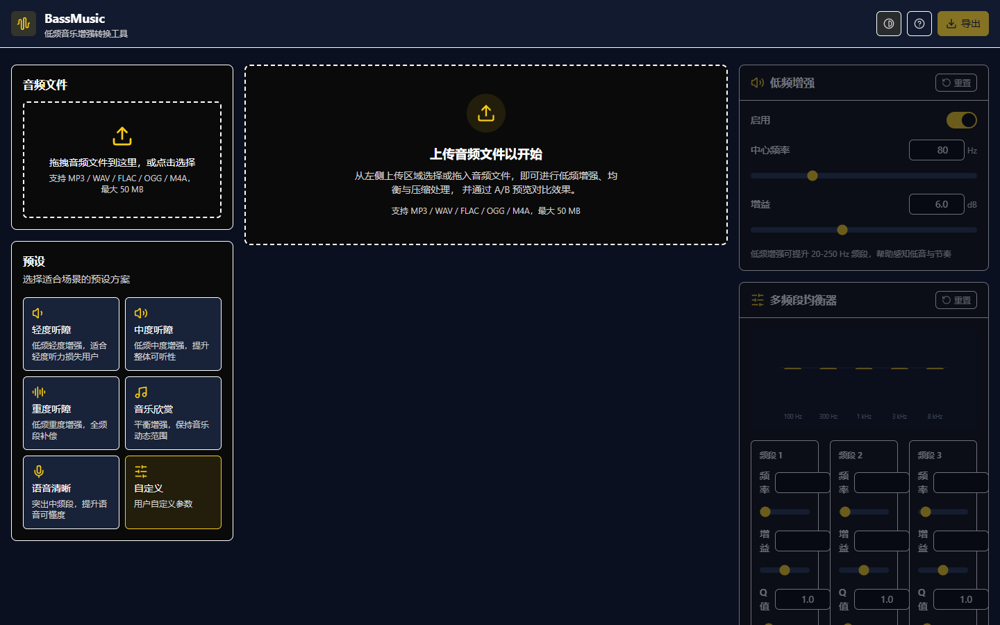
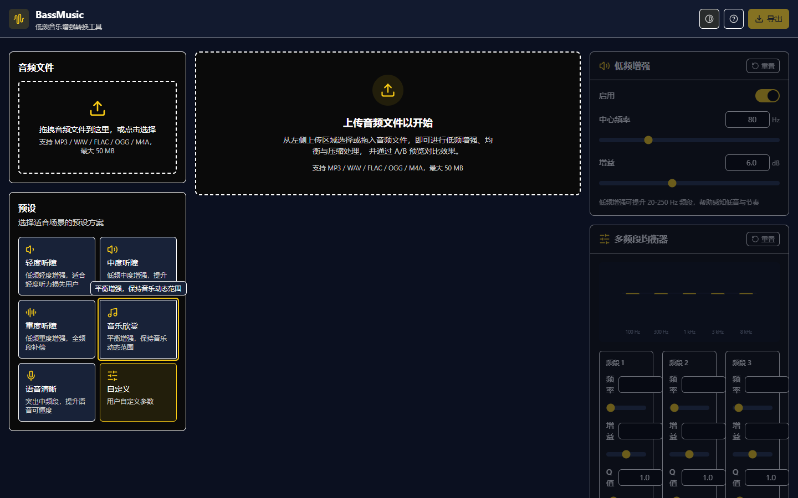

# BassMusic - 低频音乐增强转换工具

<p align="center">
  <strong>面向听障用户的纯浏览器端音频增强 Web 应用</strong>
  <br/>
  <em>零服务器依赖 · 实时 A/B 预览 · 完整无障碍支持 · 数据本地化</em>
</p>

---

## 项目简介

BassMusic 是一款面向听障用户的低频音乐/音频转换 Web 应用。它完全运行在浏览器中，无需任何后端服务，通过 Web Audio API 提供低频增强、多频段均衡、动态范围压缩等音频处理能力，帮助听障用户更清晰、更完整地聆听音乐和各类音频内容。

项目目标是为听障人士提供一款轻量化、易用、隐私安全的音频增强工具。技术亮点包括：纯浏览器端运行、零服务器依赖、实时 A/B 预览、丰富的无障碍支持，所有音频数据始终留在用户设备上。

### 核心价值

- **隐私优先**：所有音频处理在本地完成，无网络请求，不上传任何数据
- **即开即用**：无需安装、无需注册，打开浏览器即可使用
- **无障碍设计**：以 WCAG 2.1 AA 为基准，视障与听障用户均可顺畅操作
- **专业音频处理**：基于 Web Audio API 原生节点链，低延迟、高保真

---

## 功能特性

- **音频文件上传与解码**：支持 MP3/WAV/FLAC/OGG/M4A，单文件最大 50 MB，支持拖拽与点击两种上传方式
- **低频声波增强**：基于 BiquadFilterNode LowShelf 类型，中心频率 20–250 Hz 可调，增益 0–+15 dB
- **多频段均衡器**：5 段 Peaking Filter，频段覆盖 60 Hz–16 kHz，每段可独立调节中心频率、增益（-12–+12 dB）、Q 值（0.5–6.0）
- **动态范围压缩**：基于 DynamicsCompressorNode，可调阈值、压缩比、Attack/Release 时间与输出增益补偿
- **6 种听障程度预设**：轻度/中度/重度听障、音乐欣赏、语音清晰、自定义，一键应用整套参数
- **A/B 实时预览对比**：原始信号与处理后信号无缝切换，切换延迟低于 100 ms，参数调整实时生效
- **波形可视化**：基于 Canvas 绘制，支持多声道（左/右声道）显示
- **音频导出**：支持 WAV（16-bit PCM 原生编码）与 MP3（128/192/320 kbps，基于 lamejs）
- **完整无障碍支持**：符合 WCAG 2.1 AA 标准，支持键盘导航、屏幕阅读器、高对比度主题
- **响应式布局**：自适应桌面、平板、手机三种屏幕尺寸

### 预设参数对照表

各预设对应的核心参数（数据来源于 [presets.ts](file:///d:/codeFile/BassMusic/src/lib/presets.ts)）：

| 预设 | 低频增益 (80 Hz) | EQ 增益 (100/300/1k/3k/8k Hz) | 压缩阈值 | 压缩比 | 输出增益 |
| --- | --- | --- | --- | --- | --- |
| 轻度听障 | +6 dB | 2 / 3 / 3 / 2 / 1 | -30 dB | 2:1 | +2 dB |
| 中度听障 | +9 dB | 4 / 5 / 6 / 4 / 3 | -24 dB | 4:1 | +4 dB |
| 重度听障 | +12 dB | 6 / 6 / 6 / 6 / 6 | -18 dB | 8:1 | +6 dB |
| 音乐欣赏 | +4 dB | 2 / 1 / 0 / 1 / 2 | -32 dB | 2:1 | +1 dB |
| 语音清晰 | +2 dB | -2 / 2 / 6 / 6 / 2 | -20 dB | 6:1 | +5 dB |
| 自定义 | 用户自定义 | 用户自定义 | 用户自定义 | 用户自定义 | 用户自定义 |

---

## 界面预览

### 桌面端工作台

BassMusic 主页面采用响应式三栏布局：左侧为文件上传与预设选择，中间为波形可视化与播放控制，右侧为参数调节面板（低频增强 / 均衡器 / 动态范围压缩）。



*桌面端三栏布局：上传 → 预设 → 波形 → 播放器 → 参数面板*

### 移动端响应式适配

在手机等小屏设备上，界面自动切换为单列垂直堆叠，保证关键控件易于触达，参数面板按使用频率自上而下排列。



*移动端单列布局：导航 → 上传 → 预设 → 波形 → 播放 → 参数面板*

### 帮助对话框

点击顶部导航栏的"帮助"按钮可打开帮助对话框，内含快速上手指南、功能说明与快捷键列表，支持 Esc 键或点击遮罩关闭。


*帮助对话框：提供快速上手指南与功能说明*

---

## 技术栈

- **React 18 + TypeScript 5**：前端框架与类型系统
- **Vite 5**：构建与开发服务器
- **Tailwind CSS 3**：原子化样式
- **zustand 4**：轻量状态管理
- **lucide-react**：图标库
- **lamejs**：MP3 编码
- **Web Audio API**：音频解码、处理与离线渲染
- **vitest**：单元测试框架

---

## 快速开始

### 环境要求

- Node.js 18+（推荐 20 LTS）
- npm 9+（或 pnpm / yarn）

### 安装与运行

```bash
# 安装依赖
npm install

# 启动开发服务器（默认地址 http://localhost:5173）
npm run dev

# 类型检查
npm run typecheck

# 运行单元测试
npm run test

# 生产构建（含类型检查）
npm run build

# 预览生产构建产物
npm run preview
```

开发服务器启动后，默认访问地址为 http://localhost:5173 。

---

## 使用指南

### 第 1 步：上传音频文件

在上传区域通过拖拽或点击选择本地音频文件（MP3/WAV/FLAC/OGG/M4A，单文件不超过 50 MB）。上传成功后，系统会在浏览器端解码并显示文件名、时长、采样率、声道数等元信息。

### 第 2 步：选择预设或自定义参数

- **一键应用**：在预设选择器中选择"轻度/中度/重度听障""音乐欣赏"或"语音清晰"，系统立即应用整套优化参数。
- **自定义调节**：在低频增强、均衡器、动态范围压缩面板中手动调整任意参数。一旦手动修改，预设会自动切换为"自定义"。

### 第 3 步：A/B 预览对比

点击播放按钮开始预览。播放过程中可随时切换"原始/处理"按钮，实时对比处理前后效果。所有参数调整会即时反映在预览音频中（延迟低于 50 ms）。

### 第 4 步：导出处理后的音频

点击"导出"打开导出对话框，选择目标格式：

- **WAV**：16-bit PCM，无损原生离线渲染
- **MP3**：可选 128 / 192 / 320 kbps 比特率

确认后系统使用 OfflineAudioContext 离线渲染并触发浏览器下载。导出过程会显示进度条，并禁用导出按钮以防重复点击。

> 💡 **提示**：首次使用建议点击顶部导航栏的"帮助"按钮，查看完整的功能说明与快捷键列表。

---

## 无障碍特性

BassMusic 以 WCAG 2.1 AA 为基准设计无障碍体验，确保视障与听障用户均可顺畅使用：

- **完整键盘导航**：支持 Tab 切换焦点、方向键与 PageUp/PageDown 调节滑块、Enter/Space 激活按钮
- **屏幕阅读器支持**：所有交互控件配备 `aria-label`、`role` 与 `aria-describedby`，状态变化与错误信息均被正确朗读
- **高对比度主题**：提供主题切换，关键文字与背景颜色对比度不低于 4.5:1
- **焦点样式可见**：所有可聚焦元素具备清晰可辨的焦点轮廓
- **跳到主内容链接**：页面顶部提供跳转链接，便于键盘用户快速进入主体内容
- **错误提示无障碍**：错误信息使用 `role="alert"`，确保即时告知辅助技术
- **滑块数值可输入**：每个滑块同时配备数值显示与可手动输入数值的输入框

### 高对比度模式

点击顶部导航栏的"高对比度"按钮即可切换主题，强化文字与背景对比度，提升弱视用户的可读性。



*高对比度主题：关键元素对比度符合 WCAG 2.1 AA 标准*

### 键盘焦点导航

所有可聚焦元素均具备清晰可见的焦点轮廓，键盘用户可通过 Tab 键顺畅穿梭于各功能面板之间。



*键盘焦点样式：可见的焦点轮廓辅助键盘导航*

---

## 项目结构

```
d:\codeFile\BassMusic\
├── src/
│   ├── components/        # React 组件
│   │   ├── ui/            # 共享基础组件（Slider/Switch/Panel/Tooltip）
│   │   ├── FileUploader.tsx
│   │   ├── PresetSelector.tsx
│   │   ├── LowShelfPanel.tsx
│   │   ├── EqualizerPanel.tsx
│   │   ├── CompressorPanel.tsx
│   │   ├── WaveformViewer.tsx
│   │   ├── PreviewPlayer.tsx
│   │   ├── ExportDialog.tsx
│   │   ├── HelpDialog.tsx
│   │   ├── ErrorBoundary.tsx
│   │   └── BrowserSupportNotice.tsx
│   ├── lib/
│   │   ├── audio/
│   │   │   ├── decoder.ts    # 解码
│   │   │   ├── processor.ts   # 处理引擎
│   │   │   └── exporter.ts    # 离线渲染与导出
│   │   ├── presets.ts        # 预设配置
│   │   ├── types.ts          # 类型定义
│   │   └── utils.ts          # 工具函数
│   ├── store/
│   │   └── useAudioStore.ts  # zustand store
│   ├── pages/
│   │   └── Studio.tsx        # 主页面
│   ├── App.tsx
│   ├── main.tsx
│   └── index.css
├── package.json
├── vite.config.ts
├── tsconfig.json
├── tailwind.config.js
└── vitest.config.ts
```

核心模块说明：

- [decoder.ts](file:///d:/codeFile/BassMusic/src/lib/audio/decoder.ts)：基于 Web Audio API 的 `decodeAudioData` 进行客户端解码
- [processor.ts](file:///d:/codeFile/BassMusic/src/lib/audio/processor.ts)：构建音频处理节点链（LowShelf → EQ → Compressor）
- [exporter.ts](file:///d:/codeFile/BassMusic/src/lib/audio/exporter.ts)：基于 OfflineAudioContext 离线渲染并编码为 WAV/MP3
- [presets.ts](file:///d:/codeFile/BassMusic/src/lib/presets.ts)：6 种预设的参数定义与预设应用/反查逻辑
- [types.ts](file:///d:/codeFile/BassMusic/src/lib/types.ts)：全局类型契约与默认参数常量
- [useAudioStore.ts](file:///d:/codeFile/BassMusic/src/store/useAudioStore.ts)：基于 zustand 的全局状态管理

---

## 浏览器兼容性

| 浏览器 | 最低版本 | 备注 |
| --- | --- | --- |
| Chrome | 90+ | 完整支持 |
| Edge | 90+ | 完整支持 |
| Firefox | 88+ | 完整支持 |
| Safari | 14.1+ | 部分音频格式（如 OGG）支持有限 |

运行环境需要 Web Audio API 与 OfflineAudioContext 支持。应用启动时会自动检测浏览器能力，不支持时会显示友好提示。

---

## 隐私说明

BassMusic 高度重视用户隐私。所有音频处理完全在用户浏览器中完成，不会上传任何音频数据到服务器，全程无网络请求。上传的音频文件、处理参数与导出结果均仅保存在用户本地设备，确保数据不被第三方获取。

---

## 开发说明

- **路径别名**：`@/` 指向 `src/` 目录，便于模块引用
- **TypeScript 严格模式**：开启严格类型检查，构建前执行 `tsc --noEmit`
- **单元测试**：测试文件位于各模块旁的 `.test.ts` 中，共 70 个用例覆盖解码、处理、导出、预设与 store
- **测试命令**：`npm run test`（单次运行）或 `npm run test:watch`（监听模式）
- **代码风格**：使用 Tailwind CSS 原子类构建样式，组件按功能模块组织
